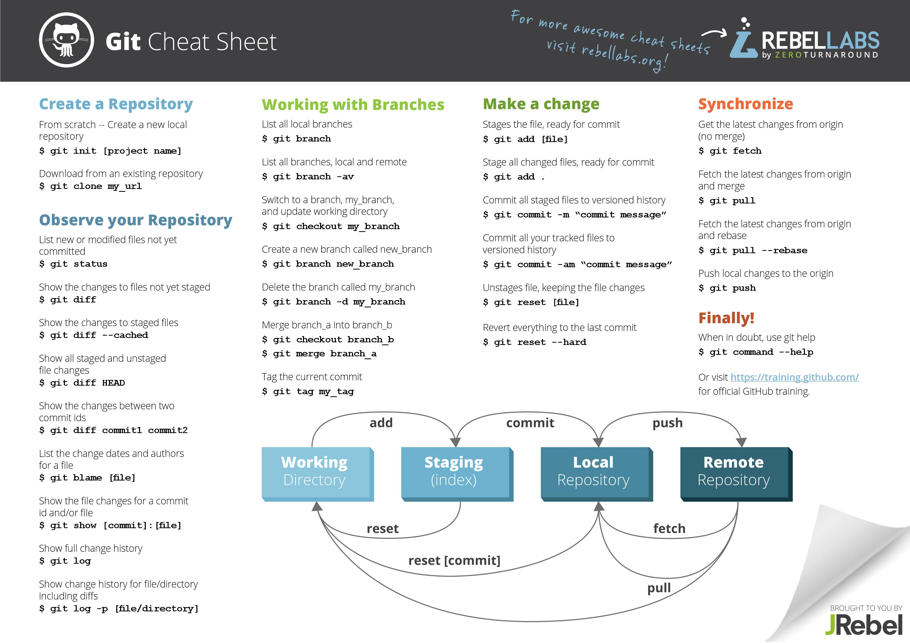

# 

Repository with all my notebooks :P

## NoteBooks

* Development
  * [Git & GitHub](#git)
  * [C & C++](#cpp)
  * [Java 8 (WIP)](#java)

 

### Git

1. Introduction to Git and GitHub
2. Some vocabulary
3. CLI (Command Line Interface)
4. WorkFlow

### Cpp

1. Development Enviroments 
2. Hello world
3. Variables and Constants 
4. Operators
5. Pointers and References
6. Standart Input/Output
7. Flow Control
8. Arrays 
9. Strings
10. Structures
11. Functions
12. Files in C y C++ 
13. Dynamic Structures 
14. OOP
15. Programming Techniques
16. Frameworks 

### Java

1. Introduction to the JAVA language
2. OOP
3. Database Access (JDBC)
4. Disenio de aplicaciones JAVA (1/2)
5. Graphic interfaces (GUI)
6. Multithreading (hilos)
7. Networking
8. Disenio de aplicaciones JAVA (2/2)
9. Dynamic Data Structures
10. Parametrization using XML
11. Introspection of classes and objects
12. Generalizations and development of frameworks
13. Input/Output
14. Final considerations
15. ORM and persistence data
16. Dependency injection
17. Update to Java 8

> Java quick reference [PDF](http://overapi.com/static/cs/java_quickref.pdf)

 

#### Soon more notebooks